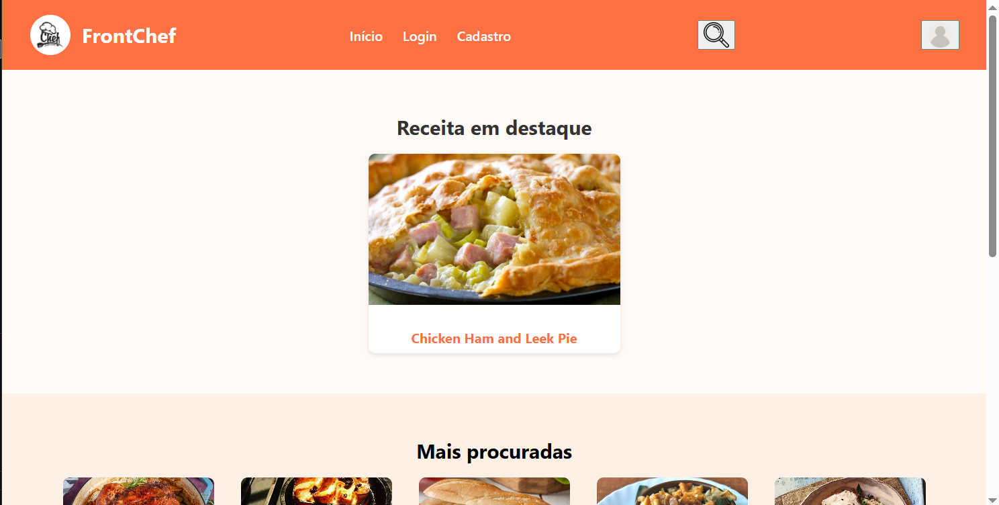
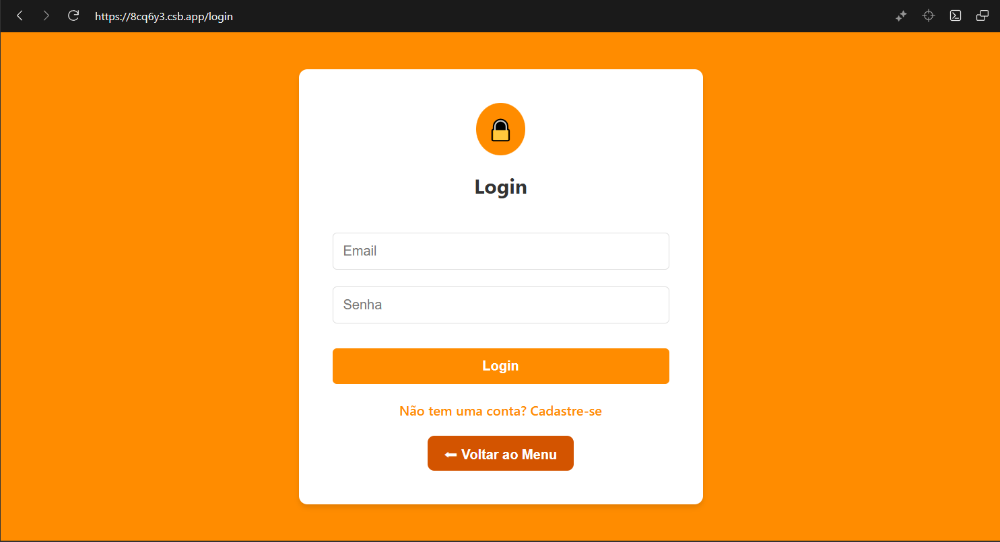
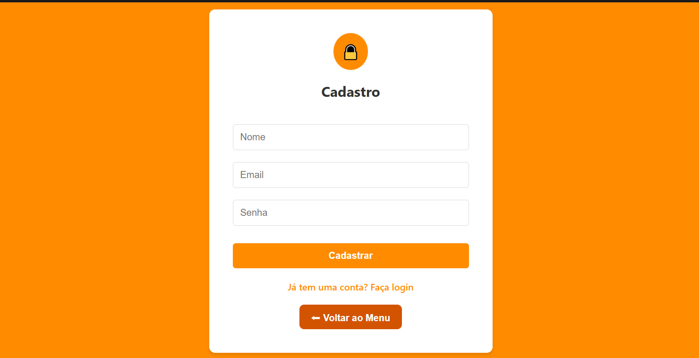
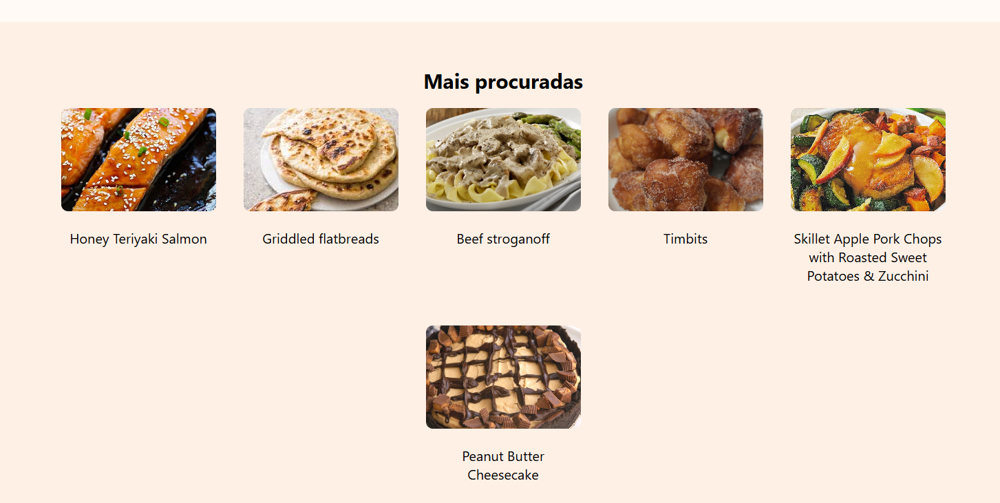
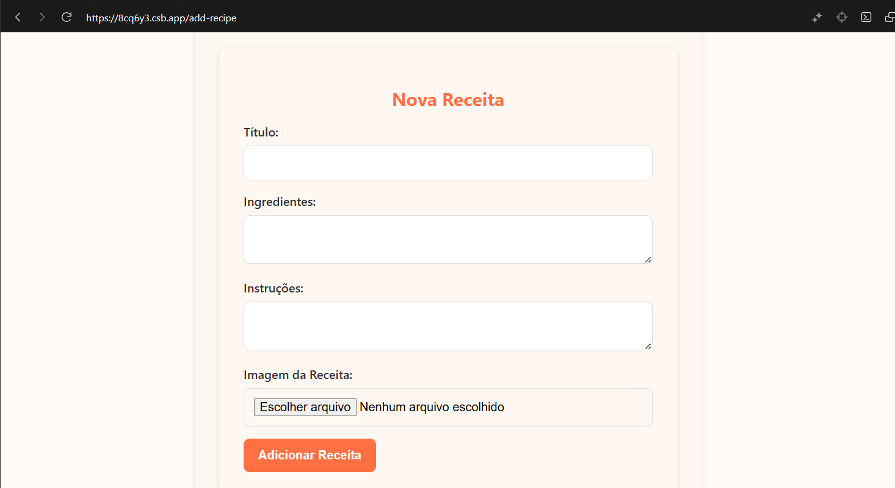

# Food Recipes App

Aplicação desenvolvida em React com TypeScript e CSS.  
O projeto permite visualizar receitas, buscar pratos, ver detalhes, ingredientes e vídeos relacionados.

---

## Instalação e Execução

### Pré-requisitos  
Qualquer ambiente capaz de executar projetos React + TypeScript.  
Exemplos: VS Code com Live Server ou similar.

### Como executar

1. Baixe ou clone o repositório:
git clone https://github.com/mlnc2/Trabalho-Faculdade-React.git

2. Abra a pasta do projeto na sua IDE.

3. Execute o servidor utilizado pela equipe (Live Server, servidor da IDE etc.).

4. A aplicação abrirá no navegador.

---

## Tecnologias utilizadas

- React  
- TypeScript  
- CSS

---

## Integrantes e Componentes Desenvolvidos

### João Paulo
- Footer.tsx  
- Navbar.tsx

### Ângelo
- RecipeDetails.tsx  
- RecipeVideo.tsx  
- Ingredients.List.tsx

### Henderson
- PopularRecipes.tsx  
- Carousel.tsx

### Gabriel
- RecipeListProps  
- RecipeList

### Marlon
- RecipeCard  
- SearchBar

---

## Prints das Telas Principais

---

## Como usar

1. A página inicial exibe receitas populares.  
2. A barra de busca permite pesquisar receitas pelo nome.  
3. Ao clicar em uma receita, são exibidos detalhes, ingredientes e vídeo.  
4. O carrossel exibe sugestões em destaque.

---
